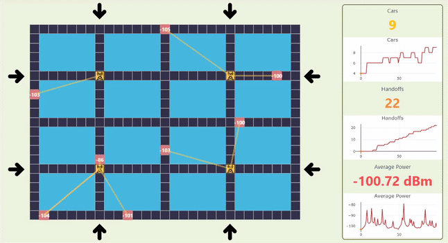
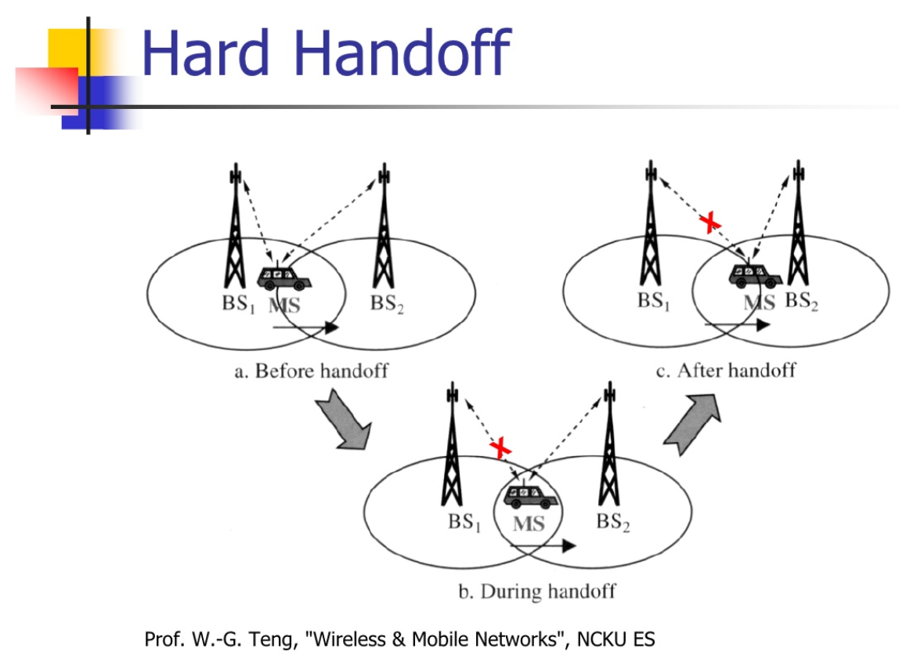

<p align=center>
    
</p>

> 📶 Visualizing the transmission between users and base stations!

Handoff is the **transition** for any given user of signal transmission from one base station to a geographically adjacent base station as the user moves around. In this project, we **visualize** the process of handoff by generating cars moving around the blocks and connecting them to different base stations based on different policies.

This project is to **visualize** handoff and make the concept of handoff in wireless network easy to understand. **Different policies** are implemented to perform the handoff in different situations. The goal is to make the users try out all the different policies, understand the differences, and find out the most efficient policy.

If your are interested in this visualiztion, please also check out the [handoff-simulator](https://github.com/chonyy/handoff-simulator). We want people to understand handoff in this visualizer project, and we **value the data** in that [handoff-simulator](https://github.com/chonyy/handoff-simulator).

## Simulation Structure

<p align=center>
    
</p>
Each node is a 20 * 20 (m^2) square. A block is composed of 24 nodes, whick makes the block size 120 * 80 (m^2). Cars are assummed to be moving on an extremely thin line path between blocks, the path doesn't take up any space. The velocity of the car is 20m/s. In our simulation, we iterate once in a second. The cars move one node, and all the data are calculated and updated every second.

- **Velocity** = 72km/hr = 20m/s
- **Probability of cars entrance** follows [Poisson distribution](https://en.wikipedia.org/wiki/Poisson_distribution)
- **⋋** = 1 cars/ min [ P(t) = ⋋"e" ^(−"⋋" ) (t is in sec) ]
- **Probability of cars turning** based on predefined value listed below
- **Received Power Calculation** explained below

### Car Entrance Distribution

The probability of the entrance follows [Poisson distribution](https://en.wikipedia.org/wiki/Poisson_distribution) and 

In our simultation

- **⋋** = 0.0167 cars/ sec
- **k** = 1

### Received Power

The received power is calculated by the formula below. Read [ScienceDirect](https://www.sciencedirect.com/topics/engineering/received-signal-power) to dig deeper.

- Base station transmission Pt(mW) = -50 dBm
- Base = 1mW
- 10log(Pt / Base) = dBm
- First-meter path loss = 10 dBm
- **P0 = -50 dBm**
- **Pd = -50 - 10 - 20log(d(m) / 1m)**

## Policies Pseudocode

Received Power referred to **P**, base station referered to **B**.

Threshold referred to **T**, entrophy referred to **E**.

### Best Policy

```javascript
if (Pnew > Pold) {
  car.bs = Bnew;
  car.power = Pnew;
}
```

### Threshold Policy

```javascript
if (Pnew > Pold && Pold < T) {
  car.bs = Bnew;
  car.power = Pnew;
}
```

### Entrophy Policy

```javascript
if (Pnew > Pold + E) {
  car.bs = Bnew;
  car.power = Pnew;
}
```

### Minimum Policy

```javascript
if (Pnew < Pmin) {
  car.bs = Bnew;
  car.power = Pnew;
}
```

## What is handoff?

<p align=center>
    
</p>

[Handoff](https://searchmobilecomputing.techtarget.com/definition/handoff) is the **transition** for any given user of signal transmission from one base station to a geographically adjacent base station as the user **moves around**.

Each time a mobile or portable cellular subscriber passes from one cellinto another, the network automatically **switches** coverage responsibility from one basestation to another. Each base-station transition, as well as the switching processor sequence itself, is called handoff.

## Policies parameter value

The different parameters for each policy are listed below.

| Parameters |  Value   |
| ---------- | :------: |
| Threshold  | -108 dBm |
| Entrophy   |  5 dBm   |
| Minimum    | -112 dBm |

## Posssibility of turning

The possibility of changing direction when encountering intersection is listed below.

### Intersection with four roads

| Direction   | Possibility |
| ----------- | :---------: |
| Go straight |     1/2     |
| Turn right  |     1/3     |
| Turn left   |     1/6     |

### Intersection with three roads

| Direction  | Possibility |
| ---------- | :---------: |
| Turn right |     1/2     |
| Turn left  |     1/2     |

This project was bootstrapped with [Create React App](https://github.com/facebook/create-react-app).
